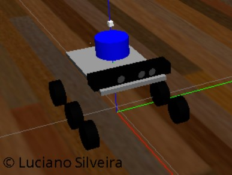
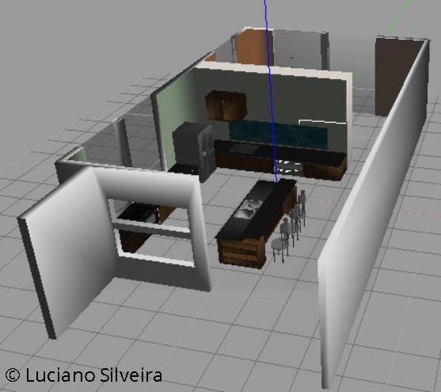

# RoboND-MapMyWorld-Project-P7
Localization and mapping using RTAB-Map

## Abstract

[Gazebo](http://gazebosim.org/) 
[RViz](http://wiki.ros.org/rviz)

SLAM or Simultaneous Localisation and Mapping is an important topic within the Robotics community. It is not a particular algorithm or piece of software, but rather it refers to the problem of trying to simultaneously localise (i.e. find the position/orientation of) some sensor with respect to its surroundings, while at the same time mapping the structure of that environment.

In this project we evaluate the usage of RTAB-Map to localize and map an autonomous rover in an indoor environment.

## Introduction

SLAM is central to a range of indoor, outdoor, in-air and underwater applications for both manned and autonomous vehicles. It is known to be a difficult problem because it is a chicken-or-egg problem where a map is needed for localization and a pose estimate is needed for mapping.

RTAB-Map (Real-Time Appearance-Based Mapping) is a RGB-D Graph SLAM approach based on a global Bayesian loop closure detector. The loop closure detector uses a bag-of-words approach to determinate how likely a new image comes from a previous location or a new location. When a loop closure hypothesis is accepted, a new constraint is added to the map's graph, then a graph optimizer minimizes the errors in the map. A memory management approach is used to limit the number of locations used for loop closure detection and graph optimization, so that real-time constraints on large-scale environnements are always respected.

In our simulation environment a rover called `ls_bot` is equipped with a RGB-D camera and a Lidar sensor and is driven around two different environments. The objective is to create a 2D and 3D representation of it's surroundings.



The `ls_bot` is an extension from the [rocker-bogie project](https://github.com/SyrianSpock/rover). Several changes were needed to make to compile using the ROS Kinetic Kame default infrastructure. The autonomous rover includes a RGB-D camera, and Lidar sensors. The sensory information was added using the [Gazebo plugins reference](http://gazebosim.org/tutorials?tut=ros_gzplugins). The visualization in [Rviz](http://wiki.ros.org/rviz) is as follows: 


using the provided environment:



The objective is to create a 2D/3D mapping of those environments using the RTAB-Map package.

## Background

is a RGB-D SLAM approach with real-time constraints.

Navigation is one of the most challenging competencies required of a mobile robot. Success in navigation requires success at the following:

 * `perception`: interpret robot's sensors to extract meaningful data
 * `localization`: determine its position within the environment
 * `cognition`: decide how to act to achieve its goals
 * `motion control`: the robot must modulate its actuators to achieve the desired goals.

Localization has received the greatest research attention during the past decades and is still being an active research area; significant advances have been made.

TODO RTAB.


### RTAB

## Results

### Validation

#### roswtf

```sh
user@machine:~/catkin_ws/ros$ roswtf 
Loaded plugin tf.tfwtf
Loaded plugin openni2_launch.wtf_plugin
No package or stack in context
================================================================================
Static checks summary:

No errors or warnings
================================================================================
Beginning tests of your ROS graph. These may take awhile...
analyzing graph...
... done analyzing graph
running graph rules...
... done running graph rules
running tf checks, this will take a second...
... tf checks complete

Online checks summary:

Found 2 warning(s).
Warnings are things that may be just fine, but are sometimes at fault

WARNING The following node subscriptions are unconnected:
 * /rtabmap/rtabmap:
   * /rtabmap/user_data_async
   * /rtabmap/initialpose
   * /rtabmap/move_base/status
   * /rtabmap/goal
   * /rtabmap/global_pose
   * /rtabmap/goal_node
   * /rtabmap/move_base/feedback
   * /rtabmap/move_base/result
 * /gazebo:
   * /gazebo/set_link_state
   * /gazebo/set_model_state
 * /rviz:
   * /move_base/TrajectoryPlannerROS/global_plan
   * /map_updates
   * /move_base/TrajectoryPlannerROS/local_plan
   * /rtabmap/octomap_grid_updates

WARNING These nodes have died:
 * urdf_spawner-5


Found 1 error(s).

ERROR Different number of openni2 sensors found.
 * 0 openni2 sensors found (expected: 1).
```


### Mapping

To execute the mapping step use the `kitchen.launch` file:

```xml
<!-- Kitchen -->
<include file="$(find slam_project)/launch/world.launch" />
<include file="$(find slam_project)/launch/teleop.launch" />
<include file="$(find slam_project)/launch/mapping.launch" />
```

### Localization


### Launch files

```sh
roslaunch slam_project kitchen.launch
roslaunch slam_project world.launch
roslaunch slam_project mapping.launch
roslaunch slam_project teleop.launch
roslaunch slam_project rtabmapviz.launch
```

For evaluation of the database:

```sh
rtabmap-databaseViewer ~/.ros/rtabmap.db
```

### Other utilities

```sh
rosrun rqt_tf_tree rqt_tf_tree &
rosrun rqt_reconfigure rqt_reconfigure &
rqt_robot_steering
```


## Discussion

TODO

## Considerations

### Virtual Machine

## Conclusion / Future Work

### Links:
 * [SDF format](http://sdformat.org/spec?ver=1.6&elem=sdf)
 * [This repository](https://github.com/ladrians/RoboND-MapMyWorld-Project-P7)
 * [Project Rubric](https://review.udacity.com/#!/rubrics/1441/view)
 * [Gazebo](http://gazebosim.org/)
 * [Gazebo Model creation](http://playerstage.sourceforge.net/doc/Gazebo-manual-svn-html/tutorial_model.html)
 * [RViz](http://wiki.ros.org/rviz)
 * [Gazebo plugins](http://gazebosim.org/tutorials?tut=ros_gzplugins)
 * [rtabmap](http://wiki.ros.org/rtabmap)
 * [rtabmap_ros](http://wiki.ros.org/rtabmap_ros)
 * [SetupOnYourRobot withb rtabmap](http://wiki.ros.org/rtabmap_ros/Tutorials/SetupOnYourRobot)
 * [What is SLAM?](https://www.kudan.eu/kudan-news/an-introduction-to-slam/)

