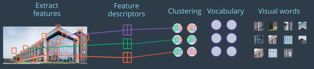
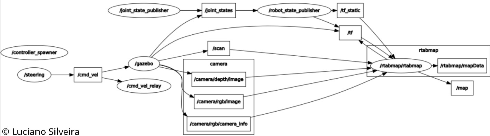

# RoboND-MapMyWorld-Project-P7
Localization and mapping using RTAB-Map

## Abstract

SLAM or Simultaneous Localisation and Mapping is an important topic within the Robotics community. It is not a particular algorithm or piece of software, but rather it refers to the problem of trying to simultaneously localise (i.e. find the position/orientation of) some sensor with respect to its surroundings, while at the same time mapping the structure of that environment.

In this project we evaluate the usage of RTAB-Map to localize and map an autonomous rover in two different environments.

## Introduction

SLAM is central to a range of indoor, outdoor, in-air and underwater applications for both manned and autonomous vehicles. It is known to be a difficult problem because it is a chicken-or-egg problem where a map is needed for localization and a pose estimate is needed for mapping.

RTAB-Map (Real-Time Appearance-Based Mapping) is a RGB-D Graph SLAM approach based on a global Bayesian loop closure detector. The loop closure detector uses a bag-of-words approach to determinate how likely a new image comes from a previous location or a new location. The following image details how the features are extracted, feature descriptor are created and clustered; a vocabulary of words is set.



When a loop closure hypothesis is accepted, a new constraint is added to the map's graph, then a graph optimizer minimizes the errors in the map. RTAB-Map supports 3 different graph optimizations:

 * Tree-based network optimizer, or TORO.
 * General Graph Optimization, or G2O.
 * GTSAM (Smoothing and Mapping).

A memory management approach is used to limit the number of locations used for loop closure detection and graph optimization, so that real-time constraints on large-scale environnements are always respected.


Graph-SLAM complexity is linear, according to the number of nodes, which increases according to the size of the map. By providing constraints associated with how many nodes are processed for loop closure by memory management, the time complexity becomes constant in RTAB-Map.

In our simulation environment a rover called `ls_bot` is equipped with a RGB-D camera and a Lidar sensor and is driven around two different environments. The objective is to create a 2D and 3D representation of it's surroundings.


The `ls_bot` is an extension from the [rocker-bogie project](https://github.com/SyrianSpock/rover). Several changes were needed to make to compile using the ROS Kinetic Kame default infrastructure. The autonomous rover includes a RGB-D camera, and Lidar sensors. The sensory information was added using the [Gazebo plugins reference](http://gazebosim.org/tutorials?tut=ros_gzplugins). The visualization in [Rviz](http://wiki.ros.org/rviz) is as follows: 


using the provided environment:


The objective is to create a 2D/3D mapping of those environments using the RTAB-Map package.

## Background

SLAM is considered a fundamental problem for robots to become truly autonomous. A large variety of different SLAM approaches have been developed since mid-eighties where the majority uses probabilistic concepts.

### RTAB

[RTAB-Map](http://introlab.github.io/rtabmap), for Real-Time Appearance-Based Mapping is a complete graph-based SLAM approach using real-time constraints. In our case we the rtabmap_ros open source ROS library available since 2013. It implements `loop closure` detection with a `memory management` approach combining other techniques to ensure that the `loop closure` process happens in real time.

`Loop closure` detection is the process used to determinate if the current observation comes from a previously visited location or a new one; if it recognizes an already mapped area, the robot `closes a loop`. As the size of the internal map increases, so does the time required to compare new observations with all stored locations, eventually limiting online processing. By revisiting already mapped areas, uncertainties in robot and landmark estimates are reduced.

The `memory management` approach runs on top of graph management modules. It is used to limit the size of the graph so that long-term online SLAM can be achieved in large environments. Without memory management, as the graph grows, processing time for modules like `Loop Closure` and `Proximity Detection`, `Graph Optimization` and `Global Map Assembling` can eventually exceed real-time constraints; meaning that the processing time can become greater than the node acquisition cycle time.

RTAB-Map's memory is divided into a Working Memory (WM) and a Long-Term Memory (LTM). When a node is transferred to LTM, it is not available anymore for modules inside the WM. When RTAB-Map's update time exceeds the fixed time threshold `Rtabmap/TimeThr`, some nodes in WM are transferred to LTM to limit the size of the WM and decrease the update time. Similarly to the fixed time threshold, there is also a memory threshold `Rtabmap/MemoryThr` that can be used to set the maximum number of nodes that WM can hold.

The structure of the map is a graph with nodes and links. After sensor synchronization, a Short-Term Memory (STM) module creates a node memorizing the odometry pose, sensor's raw data and additional information useful for next modules. There are three kind of links: `Neighbor`, `Loop Closure` and `Proximity links`. `Neighbor links` are added in the STM between consecutive nodes with odometry transformation. `Loop Closure` and `Proximity links` are added through loop closure detection or proximity detection, respectively. All the links are used as constraints for graph optimization. When there is a new loop closure or proximity link added to the graph, graph optimization propagates the computed error to the whole graph, to decrease odometry drift.

## Results

Initually the provided `teloperation` utility was used to move the rover but it proveed difficult to control, so the strategy changed to use the [steering plugin] (http://wiki.ros.org/rqt_robot_steering) from the rqt ROS utilities. The rover was moved around the environment to generate a map of the environment.

### Validation

#### Frames

In order to validate all links are properly connected; the [rqt_tf_tree](http://wiki.ros.org/rqt_tf_tree) utility was used:

```sh
rosrun rqt_tf_tree rqt_tf_tree
```

The result is as follows:


#### Nodes Graph

To validate topic names and connection between nodes; the [rqt_graph](http://wiki.ros.org/rqt_graph) utility was used with the following result:



The configuration is based on the following sensor configuration (already discussed): 


#### roswtf

The [roswtf](https://github.com/ros/ros_comm/tree/kinetic-devel/utilities/roswtf/src/roswtf) utility successfully validated the configuration, the warnings and error detailed can be discarded:

```sh
user@machine:~/catkin_ws/ros$ roswtf 
Loaded plugin tf.tfwtf
Loaded plugin openni2_launch.wtf_plugin
No package or stack in context
================================================================================
Static checks summary:
No errors or warnings
================================================================================
Beginning tests of your ROS graph. These may take awhile...
analyzing graph...
... done analyzing graph
running graph rules...
... done running graph rules
running tf checks, this will take a second...
... tf checks complete
Online checks summary:
Found 2 warning(s).
Warnings are things that may be just fine, but are sometimes at fault
WARNING The following node subscriptions are unconnected:
 * /rtabmap/rtabmap:
   * /rtabmap/user_data_async
   * /rtabmap/initialpose
   * /rtabmap/move_base/status
   * /rtabmap/goal
   * /rtabmap/global_pose
   * /rtabmap/goal_node
   * /rtabmap/move_base/feedback
   * /rtabmap/move_base/result
 * /gazebo:
   * /gazebo/set_link_state
   * /gazebo/set_model_state
 * /rviz:
   * /move_base/TrajectoryPlannerROS/global_plan
   * /map_updates
   * /move_base/TrajectoryPlannerROS/local_plan
   * /rtabmap/octomap_grid_updates
WARNING These nodes have died:
 * urdf_spawner-5
Found 1 error(s).
ERROR Different number of openni2 sensors found.
 * 0 openni2 sensors found (expected: 1).
```

#### Parameter Tuning

A valuable utility to modify node parameters is the [Dynamic Reconfigure](http://wiki.ros.org/rqt_reconfigure) node:

```sh
rosrun rqt_reconfigure rqt_reconfigure
```

#### Visualization Tools

The [rtabmap-databaseViewer](https://github.com/introlab/rtabmap/wiki/Tools) utility was used to explore the database generated when the mapping process is finished.

```sh
rtabmap-databaseViewer ~/.ros/rtabmap.db
```

Notice the detailed information for: Neighbor, Neighbor Merged, Global Loop closure, Local loop closure by space, Local loop closure by time, User loop closure, and Prior link.

### Mapping

To execute the [mapping]((ros/src/slam_project/launch/mapping.launch)) step use the [kitchen.launch]((ros/src/slam_project/launch/kitchen.launch)) file:

```xml
<!-- Kitchen -->
<include file="$(find slam_project)/launch/world.launch" />
<include file="$(find slam_project)/launch/teleop.launch" />
<include file="$(find slam_project)/launch/mapping.launch" />
```

### Localization

In order to use the generated map for [localization](ros/src/slam_project/launch/localization.launch), the following changes were done:

 * Duplicate the mapping.launch file as localization.launch
   * Remove the args="--delete_db_on_start" from the launcher file.
   * Remove the `Mem/NotLinkedNodesKept` parameter
   * add the `Mem/IncrementalMemory` parameter of type string and set it to false.

### Extra Launch files

For the evaluation of the map generated, it is possible to execute the [rtabmapviz.launch]((ros/src/slam_project/launch/rtabmapviz.launch)) file:

```sh
roslaunch slam_project rtabmapviz.launch
```

For evaluation of the database in offline mode once finished the mapping session:

```sh
rtabmap-databaseViewer ~/.ros/rtabmap.db
```

## Discussion

The [depthimage_to_laserscan](http://wiki.ros.org/depthimage_to_laserscan) package for the Kinect RGB-D sensonr was discarded as the project was run on a Virtual machine. All parameters were modified so as to consume as little processing as needed. Instead a Lidar sensor was added to improve the Odometry provided by the Gazebo simulator.

Nodes are created at a fixed rate `Rtabmap/DetectionRate` of 1 second according to how much data created from nodes should overlap each other.

The initial [Parameters](https://github.com/introlab/rtabmap/blob/master/corelib/include/rtabmap/core/Parameters.h) and [Advanced configuration](http://wiki.ros.org/rtabmap_ros/Tutorials/Advanced%20Parameter%20Tuning) was checked:

### Initial

 * `Reg/Force3DoF` set to true.
 * `Kp/DetectorStrategy` using SURF Loop Closure Detection.
 * `Kp/MaxFeatures` maximum visual words per image (bag-of-words) set to 400.
 * `SURF/HessianThreshold` to extract more or less SURF features to 100.
 * `Reg/Strategy` Loop Closure Constraint tested with Visual and ICP; ICP selected as the map got better.
 * `Vis/MinInliers` minimum visual inliers to accept loop closure set to 15.
 * `NotLinkedNodesKept` set to false to avoid saving data when robot is not moving.

### Advanced configuration

 * `queue_size` set to 10.
 * `wait_for_transform_duration` changed its default valur from 0.1 to 0.2 to be more tolerant to problems.
 * `param name="RGBD/NeighborLinkRefining` set to `true to correct odometry using the input laser topic using ICP.
 * `RGBD/ProximityBySpace` set to `true`.
 * `RGBD/AngularUpdate` set to 0.05.
 * `RGBD/LinearUpdate` set to 0.05.
 * `RGBD/OptimizeFromGraphEnd` set to `false`.
 * `Grid/3D` enabled.
 * `Grid/CellSize` set it's default value from 0.05 to 0.1.
 * `Grid/FromDepth` set to `true`.

### Troubleshooting

The provided world was not detecting collisions and thus the Lidar sensor didn't  provide any information, the `scan` topic was empty. The problem was that the default Gazebo model lacked the `collision` tag in it's [SDF](http://sdformat.org/spec?ver=1.6&elem=sdf) definition. The solution was found using this [thread](https://udacity-robotics.slack.com/archives/C9E2PMMT4/p1532492850000135) on the slack community.

```
<collision name="collision">
   <geometry>
	 <mesh><uri>model://kitchen_dining/meshes/kitchen_dining.dae</uri></mesh>
   </geometry>
</collision>
```

and updating the local gazebo folder

```sh
curl -L https://s3-us-west-1.amazonaws.com/udacity-robotics/Term+2+Resources/P3+Resources/models.tar.gz | tar zx -C ~/.gazebo/
```

## Considerations

TODO

### Virtual Machine

The environment was tested using the provided Virtual Machine.

## Conclusion / Future Work

RTAB-Map started as an appearancebased loop closure detection approach with memory management to deal with large-scale and long-term online operation. It then grew to implement Simultaneous Localization and Mapping (SLAM) on various robots and mobile platforms. As each application brings its own set of contraints on sensors, processing capabilities and locomotion, it raises the question of which SLAM approach is the most appropriate to use in terms of cost, accuracy, computation power and ease of integration. Since most of SLAM approaches are either visual or lidar-based; to do a comparison is difficult.


RTAB-Map is now a multi-purpose graph-based SLAM approach that can be used out-of-the-box by novice SLAM users and for prototyping on robot platforms with different sensor configurations and processing capabilities.

RTAB-Map can be used to conduct trials with different sensors and identify early on if a sensor is suitable for the targeted application.

The limited field of view of the front facing RGB-D camera was also a problem during navigation. If the robot did not follow a very similar path than the one done previously when mapping the environment (e.g., to avoid someone passing by), the robot could get lost as loop closures or localizations could not be detected afterward.


RTAB-Map seems to be a good solution for SLAM to develop robots that can map environments in 3D and for low-cost SLAM with RGB-D and stereo cameras.

When it comes time to design your own environment, this tool can be a good resource for checking if the environment is feature-rich enough to make global loop closures. A good environment has many features that can be associated in order to achieve loop closures.

### Links:
 * [Initial Resources](https://s3-us-west-1.amazonaws.com/udacity-robotics/Term+2+Resources/P3+Resources/Student+Project+Materials.zip)
 * [This repository](https://github.com/ladrians/RoboND-MapMyWorld-Project-P7)
 * [Project Rubric](https://review.udacity.com/#!/rubrics/1441/view)
 * [Gazebo](http://gazebosim.org/)
 * [Gazebo Model creation](http://playerstage.sourceforge.net/doc/Gazebo-manual-svn-html/tutorial_model.html)
 * [RViz](http://wiki.ros.org/rviz)
 * [Gazebo plugins](http://gazebosim.org/tutorials?tut=ros_gzplugins)
 * [rtabmap](http://wiki.ros.org/rtabmap)
 * [rtabmap_ros](http://wiki.ros.org/rtabmap_ros)
 * [SetupOnYourRobot withb rtabmap](http://wiki.ros.org/rtabmap_ros/Tutorials/SetupOnYourRobot)
 * [What is SLAM?](https://www.kudan.eu/kudan-news/an-introduction-to-slam/)
 * [rtabmap parameters](https://github.com/introlab/rtabmap/blob/master/corelib/include/rtabmap/core/Parameters.h)
 * [RTAB-Map as an Open-Source Lidar and Visual SLAM Library for Large-Scale and Long-Term Online Operation](https://introlab.3it.usherbrooke.ca/mediawiki-introlab/images/7/7a/Labbe18JFR_preprint.pdf)